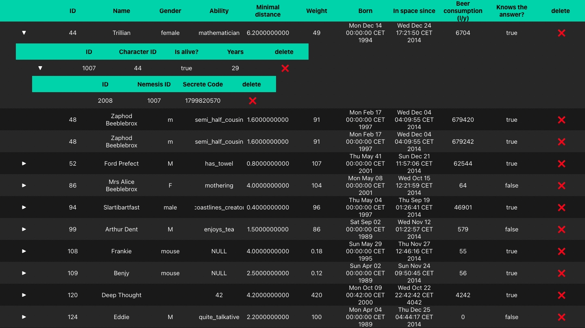
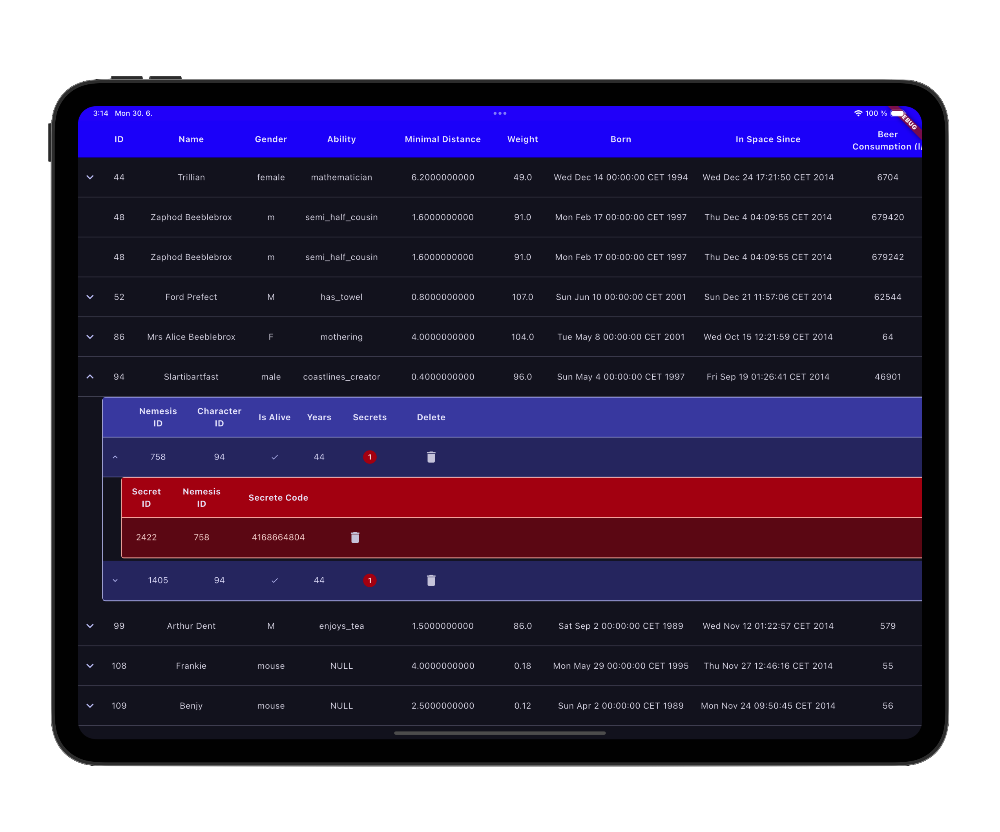

# Eterny task

## Overview

### Assigment Description

Please, develop an application which creates a hierarchy table from input data in JSON format.

Every item in JSON consists of its own data and array, which items represent child data. Item's data can have a variable number of attributes (key: value), and item can have a variable number of nested child items. When you click on an item, direct child items are hidden/shown.

There are two attachments in the email you were sent. In those, you can see an example of data in JSON and an example screenshot of the hierarchy table component.

Use the attached "data.json”(`assets/data/data.json`) and create the hierarchy table application (similar to the screenshot). The application has data and view layers, which are clearly separated. Implement a "remove" button, which deletes an item in the data and view layer in your application. If an item has children items, they have to be deleted as well. 

### Scope

- Usage of Flutter
- Usage of state management of your choice
- Structure of medium-size production application
- Focus on performance, code quality, correct usage of chosen technologies, data consistency
- Design is not important
- (Optional) Write down known issues and what you would done different if you have more time

## App preview

## Thought Process
- I started by using the project setup that I use in other production apps. My tech stack is Flutter, Bloc, Freezed, GetIt with injectable and auto_route.
- I created my usual folder structure.
- I started using localization from the beginning, even though the app is in English only. This allows for easy future localization.
- When I analyzed the content of the JSON data, I found out that there are a lot of catches:
  - JSON keys contain spaces and special characters.
  - bool values are provided as strings.
  - null values are presented as 'NULL' string or an empty string.
  - DateTime values are provided in proprietary format.
  - integer values are provided as strings.
  - children is not a list of objects but an object that contains keys that then contain lists of objects.
- After the analysis, I decided not to strongly type every value but mostly keep data as strings to ensure that the assignment of displaying values in a table goes smoothly.
- Because of the specific shape of the data, there is a need for unit tests that ensure that parsing and formatting work correctly, and it also improves the developer experience

- I created a custom DateTime parse function that handles the proprietary format and converts it to a standard DateTime object.
- I used the `timezone` package to handle timezones and ensure that the date is displayed correctly in the user's local timezone.
- DateTime values are decoded mainly because the future tasks could require sorting or filtering by date, and having a DateTime object allows for easier manipulation.

## How to run

### Prerequisites
- Flutter SDK installed (version 3.32.5 or later).
- Dart SDK installed (version 3.32.5 or later).
- An emulator or physical device for testing.
- IDE with Flutter support (e.g., Visual Studio Code, Android Studio).

### Steps to Run the Application
To run the Eterny Task application, follow these steps:

1. Clone the repository.
2. Navigate to the project directory.
3. Run `flutter pub get` to install dependencies.
4. Run `flutter pub run build_runner build --delete-conflicting-outputs` to generate code for Freezed, JSON serialization, auto_route, and dependency injection.
5. Run `flutter run` to start the application.

## Features
- Hierarchical display of JSON data in a table format.
- Expandable/collapsible items to show/hide child items.
- Remove button to delete items and their children from the data and view layer.
- Custom DateTime parsing and formatting.
- Localization support for future expansion.
- Unit tests for data parsing and formatting to ensure correctness.
- Correct usage of Flutter theming and Light and Dark modes support.
- Supported Platforms
  - iOS
  - Android
  - macOS

## Packages
- bloc https://pub.dev/packages/bloc - State management library that helps to separate business logic from UI.
- freezed https://pub.dev/packages/freezed - Code generation library for immutable classes and union types.
- get_it https://pub.dev/packages/get_it - Service locator for dependency injection and managing app-level services.
- injectable https://pub.dev/packages/injectable - Code generator for get_it dependency injection setup with annotations.
- auto_route https://pub.dev/packages/auto_route - Declarative code generation based router with nested routing support.
- flutter_svg https://pub.dev/packages/flutter_svg - SVG rendering support for Flutter applications.
- skeletonizer https://pub.dev/packages/skeletonizer - Loading state animations and skeleton screens for better UX.
- timezone https://pub.dev/packages/timezone - Comprehensive timezone data and utilities for date/time handling.
- json_serializable https://pub.dev/packages/json_serializable - Automatic JSON serialization code generation.
- flutter_gen https://pub.dev/packages/flutter_gen - Asset code generation for type-safe access to assets and resources.